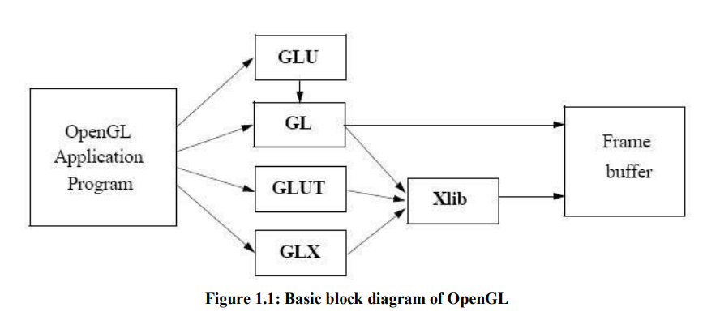

# FlappyWings with freeglut, glew and soil2

Dive into the world of FlappyWings, a captivating mini-game inspired by the iconic Flappy Bird. Built with the powerful combination of freeglut, glew, and soil2, this game promises an immersive and enjoyable experience.

GAME OVERVIEW:
In this gaming experience, the primary objective is to achieve maximum flight distance, presenting a classic case of being easy to grasp yet challenging to truly master. The initial steps involve choosing both an aircraft and a setting. Commence the adventure by clicking to initiate takeoff from an airport – and the journey unfolds!

During flight, utilize the space bar to ascend, as the plane naturally descends. Mastering this bouncing flight technique is pivotal for success. Be prepared for a barrage of missiles of various sizes, demanding swift dodging skills. Keep a vigilant eye on the fuel gauge, as it steadily depletes while you strive for greater heights. Colliding with a missile, running out of fuel, or reaching the screen's lower edge spells disaster!

The game interface unveils a loading screen, followed by a splash screen crediting the developers (Prajwal and Revanth). Subsequently, a menu appears with the following options:

- Play
- Settings
- Instructions
- Credits
- High Scores
- Exit

Players have the option to launch the game directly by selecting "Play" if they are familiar with the mechanics or have prior experience. Alternatively, those seeking guidance on how the game operates can click the "Instructions" button for a comprehensive overview. If the player has...

## Screenshots
Loading Screen

Main Menu

Choosing Plane 1

Choosing scenery

Choosing another scenery

Instruction page

Actual game play

Actual game play with different scenery and plane

High Score page

## Instructions to Run:

1. Clone or download the project.
2. Ensure you have freeglut, glew, and soil2 installed.
3. Open the project in your preferred development environment.
4. Build and run the game.
5. Enjoy the thrilling FlappyWings adventure!

## Technologies Used:

- **freeglut:** For handling OpenGL tasks and providing a platform-independent window system.
- **glew:** The OpenGL Extension Wrangler Library for easy management of OpenGL extensions.
- **soil2:** Simple OpenGL Image Library for loading and manipulating images.

## IMPLEMENTATION SUMMARY:

The project's implementation involves a integration of both built-in OpenGL functions and a range of user-defined functions, each serving distinct roles to create a comprehensive and engaging gaming experience. Within the realm of built-in functions, various Application Programming Interfaces (APIs) are employed, showcasing a sophisticated use of OpenGL capabilities.

One of the functions utilized is glutMainLoop, which initiates an event-processing loop, setting the stage for dynamic interactions within the game. The glutReshapeFunc function is leveraged to handle the reshape event triggered by window resizing, ensuring a seamless user experience during changes in display dimensions. Additionally, glutSwapBuffers proves essential for swapping front and back buffers at will, contributing to the fluidity of the application.

Matrix manipulation is a key aspect of the implementation, facilitated by functions like glPushMatrix and glPopMatrix, allowing for the stacking and retrieval of matrices with applied transformations. Translation is achieved through glTranslatef, influencing the position of elements in the virtual space. The glLineWidth function specifies the rasterized width of both aliased and antialiased lines, contributing to the visual aesthetics of the graphics.

Texture-related operations are managed using functions such as glBindTexture and glTexEnvf, providing the ability to create or use named textures and specify the texture environment, respectively. Enabling and disabling server-side OpenGL capabilities are handled by glEnable and glDisable functions, offering flexibility in managing rendering features.

The text and font aspects are addressed by functions like SetFont, glutBitmapCharacter, and glutStrokeCharacter, allowing for the customization of fonts and the rendering of characters on the display. Timer-related functionality is introduced with glutTimerFunc, registering callback functions triggered after a specified time interval, enhancing the time-dependent dynamics of the game.

Integral to the visual elements are functions that control color, initialize matrices, and manage the viewport. Functions like glColor3f, glLoadIdentity, glMatrixMode, glOrtho, glVertex3f, glViewport, and glClearColor collectively contribute to defining the appearance and spatial properties of the on-screen elements.

Moving to user-defined functions, their significance lies in tailoring specific features of the game. Functions like drawString and draw_fin_text are responsible for displaying strings on the screen and presenting the score and the number of dodged missiles during the finish screen, respectively. Other functions, such as draw_credit_text, draw_high_text, draw_menu_text, and draw_inst_text, handle the display of credits, high scores, menu items, and instructions, enhancing the overall user interface.

Further, functions like draw_chScene_text and draw_chPlane_text allow users to select scenes and planes, respectively, introducing an interactive component to the gaming experience. The draw_score function dynamically displays scores during gameplay, providing real-time feedback to the player.

The intricacies of rocket rendering are managed by functions like rocket1, rocket2, rocket3, and draw_rockets, determining the type and quantity of rockets displayed on the screen at any given moment. The draw_chosen_plane function specifically focuses on displaying the chosen plane, contributing to the user's customization experience.

Additional functionalities such as drawLogo, RenderScene, glutDisplayFunc, glutIdleFunc, glutCreateWindow, glutInit, glutInitDisplayMode, and glutInitWindowSize collectively contribute to rendering logos, defining the display callback function, managing idle events, creating OpenGL windows, initializing the interaction between the windowing system and OpenGL, specifying display mode, and setting window dimensions.

In summary, the project showcases a comprehensive utilization of OpenGL functions, encompassing both built-in APIs and custom functions, to create a dynamic and visually appealing gaming environment. The seamless integration of diverse functionalities enhances user interaction, providing a rich and immersive experience throughout the various aspects of the game.

